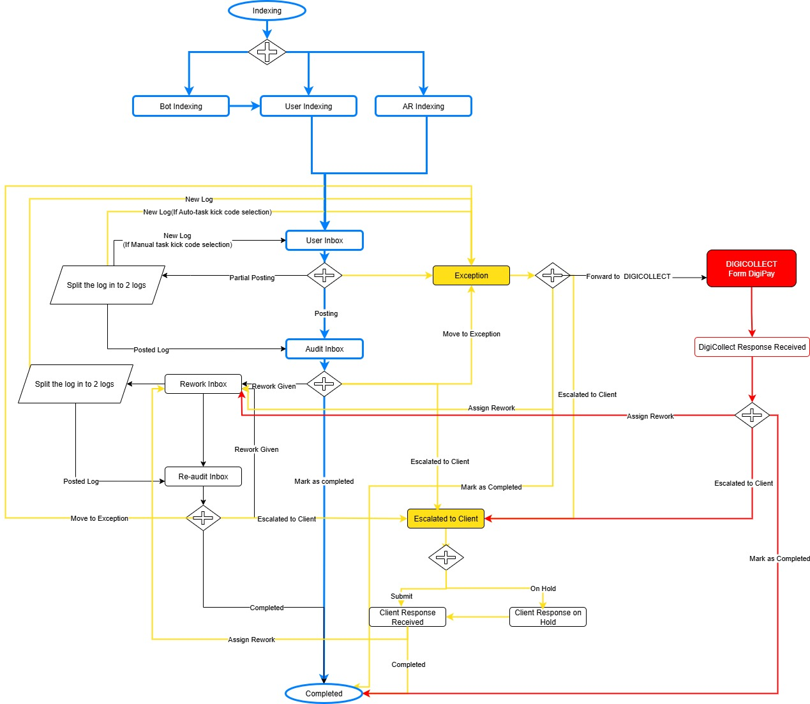
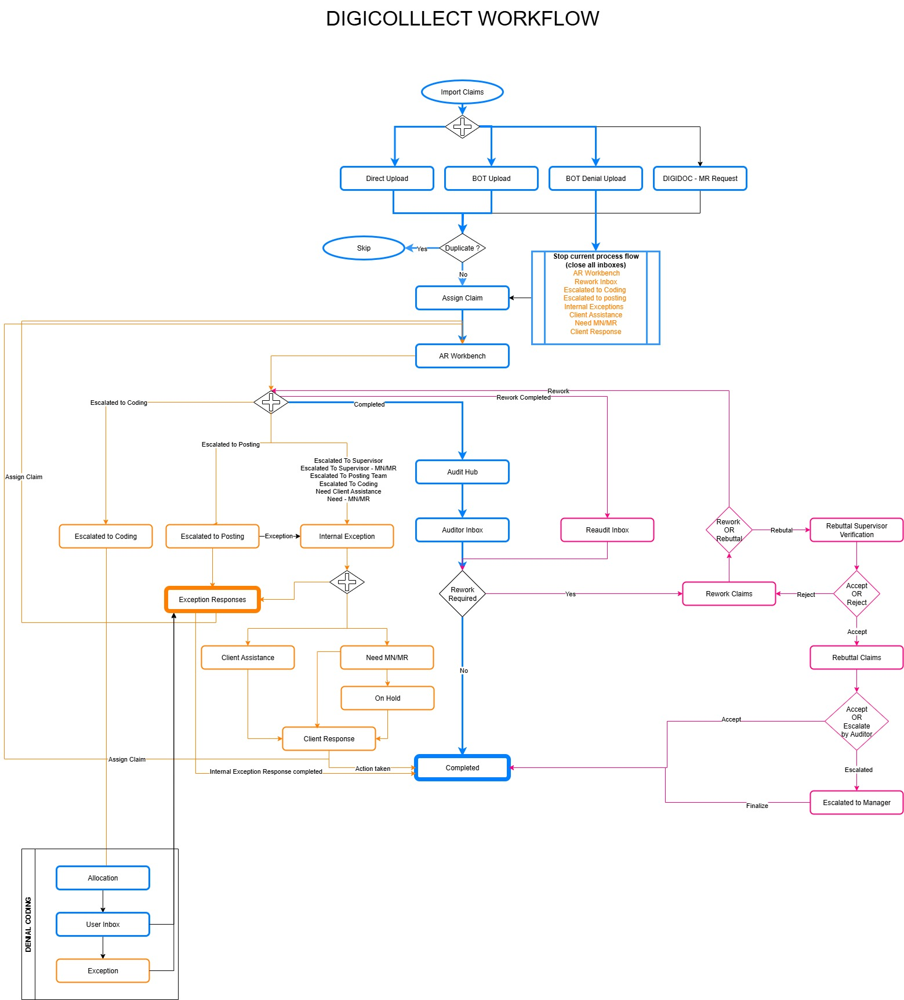
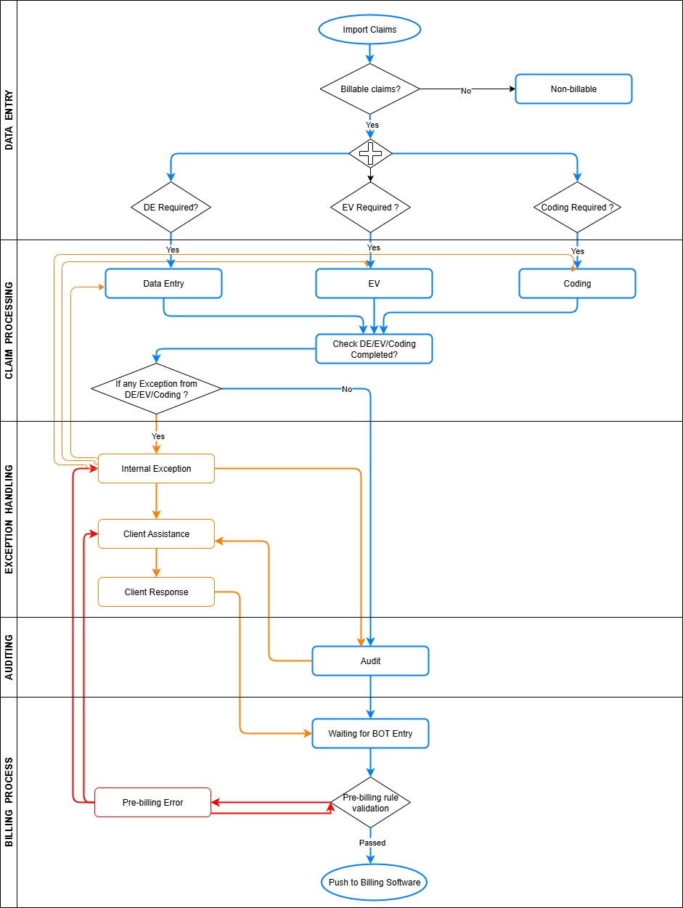
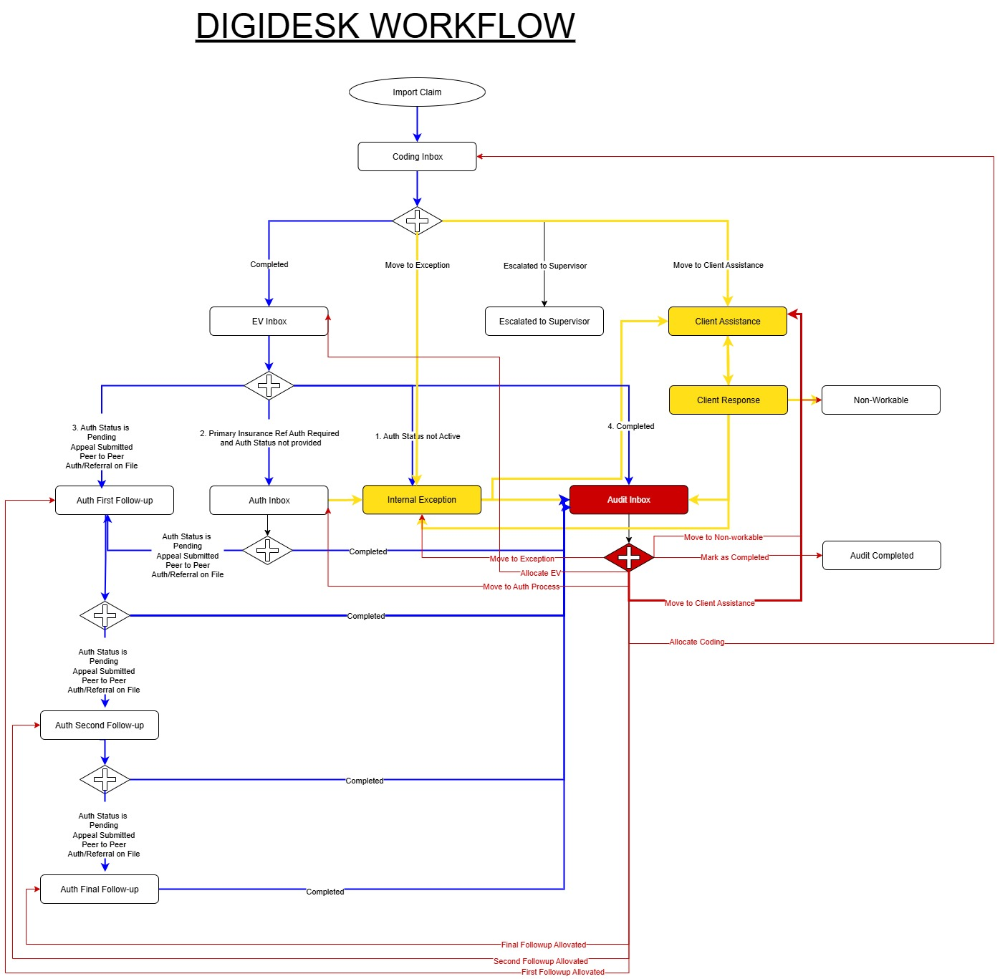
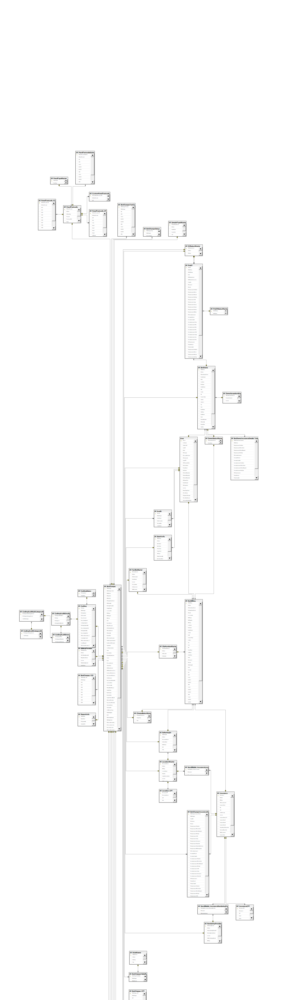

# IMPERIUM - Medical Billing System

> Healthcare ERP platform managing Medical Billing, AR Services, 
> Physician Credentialing, Attendance, and Task Management.

## Target Microservices Architecture

## Legacy Monolithic Architecture

## DIGIPAY(Payments)

## DIGICOLLECT(AR)

## DIGIFORCE(Billling)

## DIGIDESK(Patient Vist)

## DIGIFORCE Database Diagram

## Tech Stack
- **Frontend:** React JS, MVC, jQuery, Bootstrap, Knockout.js
- **Backend:** ASP.NET MVC 4.0, .NET 8 Web API
- **Database:** MS SQL Server (450+ tables, 2000+ stored procedures)
- **ORM:** Entity Framework 6.0 (26 EDMX Models)
- **Cloud:** AWS SQS
- **Integrations:** Google Drive API, Email (SMTP)
