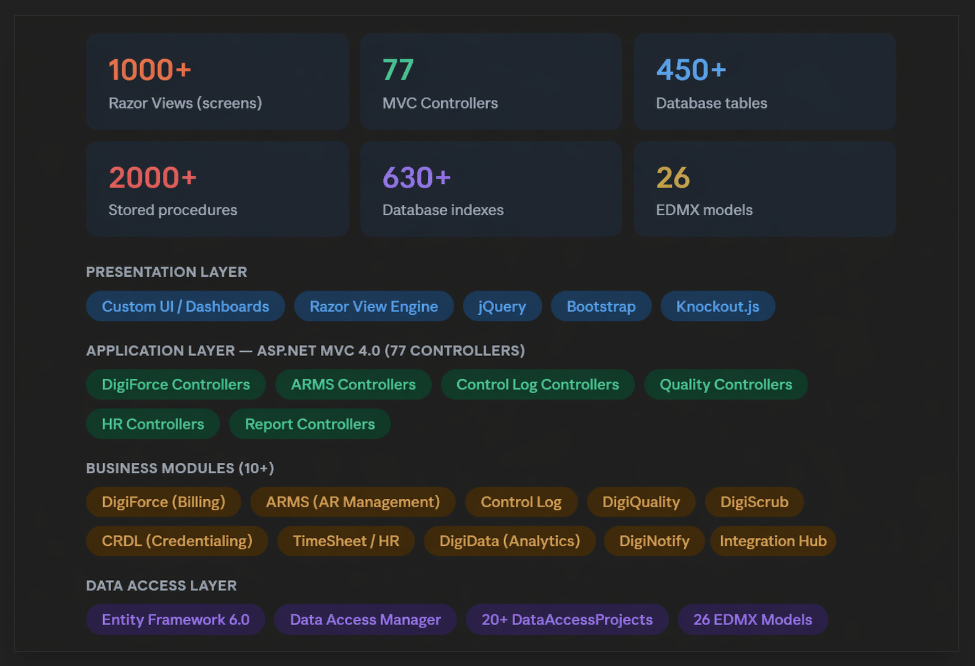
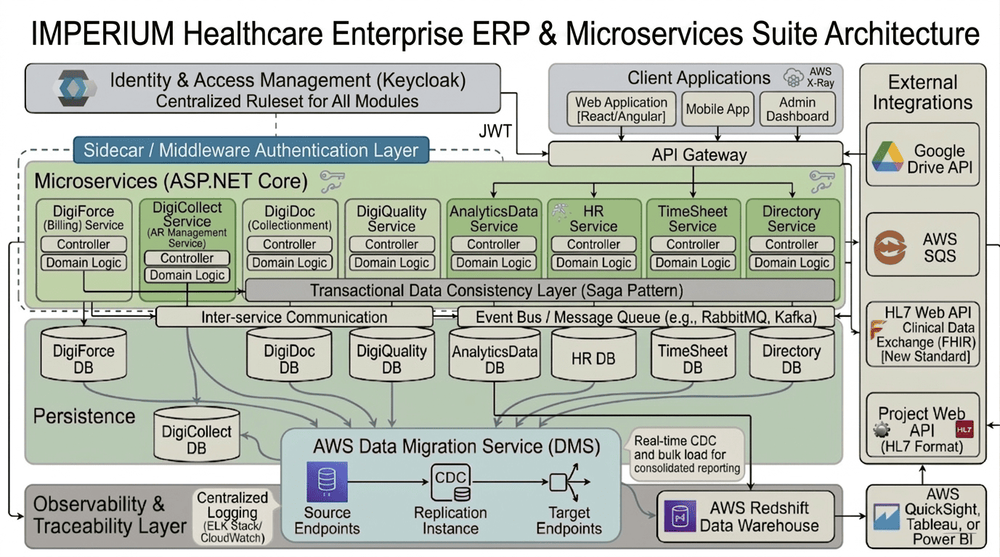
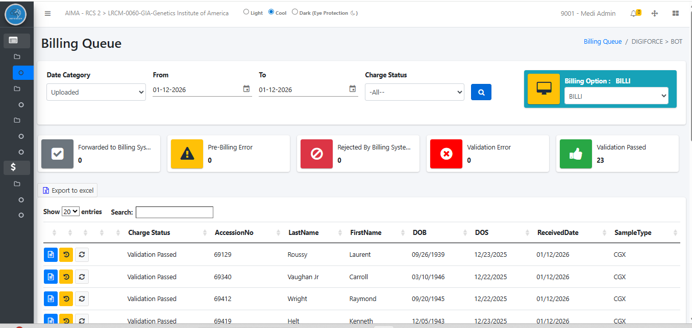
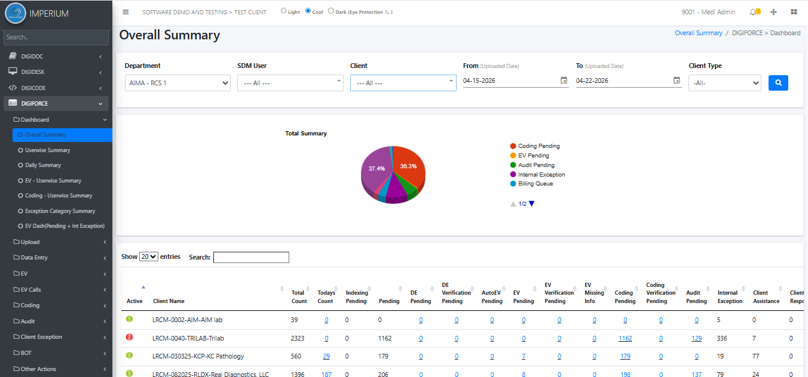
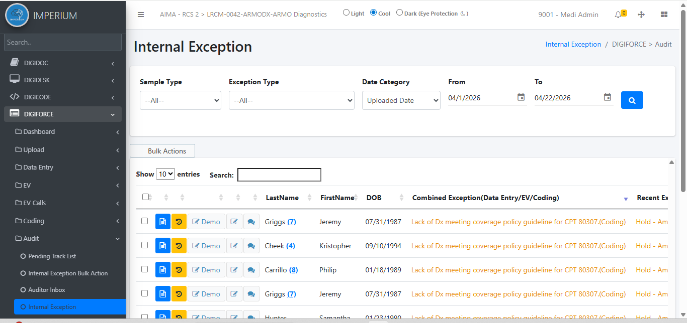
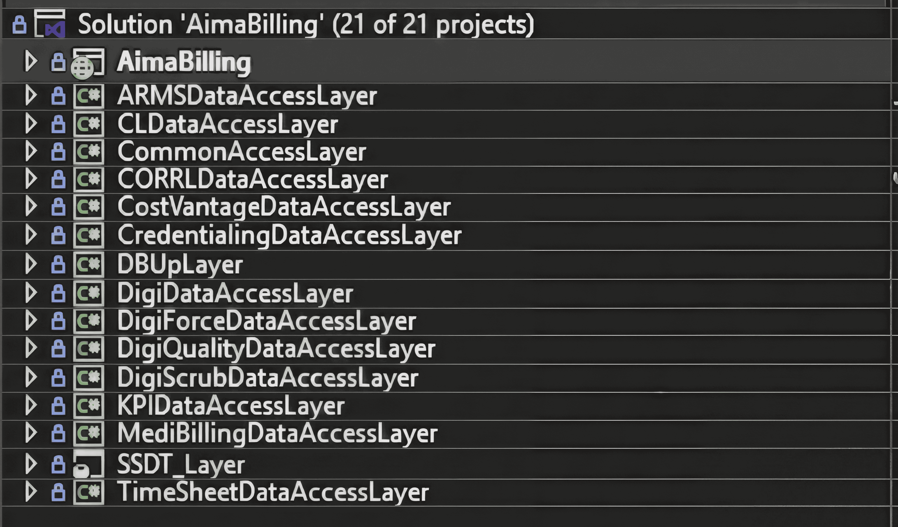

# IMPERIUM - Medical Billing System

> IMPERIUM is a large-scale, enterprise-grade Healthcare ERP platform built on ASP.NET MVC 4.0, managing the full revenue cycle and back-office operations of healthcare organizations. The system spans Medical Billing (DigiForce), Accounts Receivable Management (ARMS), Clinical Quality Tracking (DigiQuality), Charge & Claim Scrubbing (DigiScrub), Physician Credentialing (CRDL), Staff Attendance & HR (TimeSheet/HR), and Business Analytics (DigiData) — all under a unified monolithic architecture comprising 1000+ screens, 77 controllers, 20+ business modules, 450+ database tables, 2000+ stored procedures, 630+ indexes, and integrations with Google Drive API, AWS SQS, SMTP, and HL7-based healthcare interoperability standards.
> 

## Target Microservices Architecture

## Legacy Monolithic Architecture

## Operational Workflow Diagrams – Sample Collection
 
 
 

## Database Diagram – Sample Collection

 
## UI Screens – Sample Collection

## Solution Repository

## Tech Stack

- **Frontend:** React JS, MVC, jQuery, Bootstrap, Knockout.js
- **Backend:** ASP.NET MVC 4.0, .NET 8 Web API
- **Database:** MS SQL Server (450+ tables, 2000+ stored procedures)
- **ORM:** Entity Framework 6.0 (26 EDMX Models)
- **Cloud:** AWS Cloud services (CI/CD Pipeline, SQS, Lambda Functions)
- **Integrations:** Google Drive API, Email (SMTP), HL7 APIs
